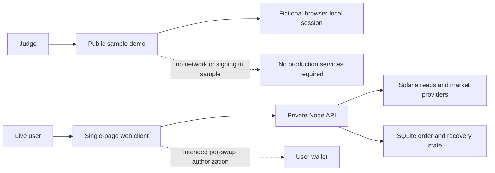

<p align="center">
  
</p>

<h1 align="center">Old shitcoins. New stock-paired plays.</h1>

<p align="center">
  <strong>Turn old meme bags into your next promising stock-paired meme.</strong><br>
  Choose the shitcoins you want to exit, set your amounts, and discover a potential next play on Solana.
</p>

<p align="center">
  <a href="https://squeezeswap.com">Open SQUEEZE</a> ·
  <a href="docs/JUDGING_GUIDE.md">Judge walkthrough</a> ·
  <a href="PROJECT_INFO.md">Project Info</a> ·
  <a href="docs/ARCHITECTURE.md">Architecture</a> ·
  <a href="README.vi.md">Tiếng Việt</a>
</p>

> **Submission snapshot · 26 September 2026.** Wallet inspection is the live entry point. **Live trading is disabled** while Jupiter transaction compatibility and execution acceptance are completed. The included demo uses fictional data and simulates every outcome; it never signs or sends a transaction. PIP's current destination selection is **rule-based**, not live AI.

## Why SQUEEZE

A wallet can become a drawer of old positions: dust, forgotten memes, tokens without prices, and balances too small to think about individually. Cleaning it up means checking what is there, deciding how much to keep, finding a destination, and reviewing a separate route for every source.

SQUEEZE is built to turn those old shitcoins and meme bags into a promising stock-paired meme token. Select the positions you want to exit, set an amount for each, and evaluate a new stock-paired destination. SOL remains an optional exit; stock-paired meme discovery is the core product. A promising candidate is not a promise of returns. The selection bag is a working list; putting a token in it does not transfer custody or move funds.

For Stocklana, the focus is discovery of **memes paired with tokenized stocks**. A stock-paired meme is a meme token whose pool uses a stock token as the quote asset. **Holding the meme does not give ownership of the underlying company.**

## The experience

| Step | What you do | What SQUEEZE makes visible |
| --- | --- | --- |
| **1 · Inspect** | Open a wallet or try sample tokens | Balances, prices where available, and explicit missing-data states |
| **2 · Select** | Choose tokens and set percentages or exact amounts | Amounts represented in integer atomic units |
| **3 · Choose** | Explore a stock-paired meme, a manual destination, or SOL | A destination explanation and its limitations |
| **4 · Review** | Inspect each source swap | Quoted amounts, minimum received and fee information |
| **5 · Follow through** | Simulate each approval in the demo | Individual results, partial completion and unresolved outcomes |

The review, approval and recovery experience is available to evaluate with sample data. It is not evidence of successful mainnet execution. Multiple sources mean individual swaps, not one atomic transaction.

<p align="center">
  
</p>

## Try it in three minutes

Website: [squeezeswap.com](https://squeezeswap.com). Domain availability is separate from this locally runnable package. On the product, choose **Try with sample tokens** to explore without connecting a wallet. For a repeatable version independent of provider availability, run this repository's sample demo:

```sh
git clone https://github.com/animeme99/SQUEEZE-Stocklana.git
cd SQUEEZE-Stocklana
node scripts/serve.mjs
```

Open **http://127.0.0.1:4187**. Requires Node.js **22.16+**. There are **no packages to install, API keys to configure, or wallets to connect**. The local server serves only `demo/` and binds to your computer's loopback address.

1. Select sample tokens and change an amount to 50%.
2. Choose **Find my next bag** or **Just get SOL**.
3. Open **Review swaps** and inspect the individual source legs.
4. Simulate each swap. Then use the sample scenario selector to explore missing data, a declined approval, partial completion or an unknown result.

See the [judging guide](docs/JUDGING_GUIDE.md) for what each scenario demonstrates.

## What is public here

This is a **curated judging package**, with fresh Git history, not the complete production repository.

| Included | Purpose |
| --- | --- |
| `demo/` | Existing browser client, packaged in sample-only mode; styles and selected brand/PIP assets |
| `src/amounts.mjs` | Five unmodified exact-amount primitives from the client domain |
| `tests/` | Reproducible precision, rounding, validation and export-boundary checks |
| `scripts/serve.mjs` | A dependency-free local static demo server |
| `PROJECT_INFO.md` and `submission/` | Copy-ready submission fields |
| `docs/` | Architecture, evaluation instructions, provenance, disclosure and verification scope |

The production backend, provider adapters, destination ranking implementation, private market registry, transaction preparation/execution services, infrastructure, databases and credentials are not included. The browser bundle is ordinary inspectable JavaScript; bundling is not code protection. The full production system cannot be rebuilt from this export. See [public scope](docs/PUBLIC_SCOPE.md).

## Engineering choices worth evaluating

- **Exact token amounts.** Integer arithmetic preserves atomic units above JavaScript's safe integer range. Percentage allocation rounds down rather than creating an extra atom.
- **Unknown stays unknown.** An unavailable price or chart is not displayed as proof of zero value or no market.
- **Selection is separate from execution.** Viewing an address and choosing tokens do not authorize transactions. The intended live flow requires the wallet to authorize each source swap.
- **Explicit partial outcomes.** The sample shows completed, failed and unresolved legs separately. A simulated pending result is checked before another attempt.
- **Stock-pair context.** The full implementation uses a stock-token registry and pool checks to distinguish a stock quote pair from a suggestive ticker. Those backend checks are described here, not independently reproduced by this demo.

## Architecture



The product uses vanilla JavaScript modules, Node.js, SQLite, Solana RPC, Jupiter, DexScreener, GeckoTerminal, Wallet Standard and Cloudflare Pages. The sample package itself has zero runtime dependencies. [Read the architecture and trust boundaries →](docs/ARCHITECTURE.md)

## Verify the public package

```sh
node --test
node scripts/check-export.mjs
```

These checks cover this public export. They do not certify the private backend, financial safety, provider coverage, or mainnet trading. [Verification scope and observed results →](docs/VERIFICATION.md)

## Current limits and next steps

| Area | Status |
| --- | --- |
| Wallet inspection | Available on the public product; provider coverage can vary |
| Local selection and amount editing | Implemented; included in the sample |
| Destination suggestion | Rule-based today; sample uses fictional candidates |
| Review and recovery walkthrough | Included as a simulation |
| Mainnet swaps | Disabled; Jupiter `route_v2` compatibility and execution acceptance pending |
| AI-driven destination selection | Planned; not claimed as live |

Next: complete transaction compatibility, qualify the funded-wallet execution and recovery flow, then enable live swaps only after those checks pass.

## Credits and usage

SQUEEZE and PIP artwork are project assets; third-party wallet marks retain their owners' rights. This is a public evaluation package, not an open-source license grant. See [NOTICE](NOTICE.md), [third-party notices](THIRD_PARTY_NOTICES.md) and the [asset index](docs/ASSETS.md).
